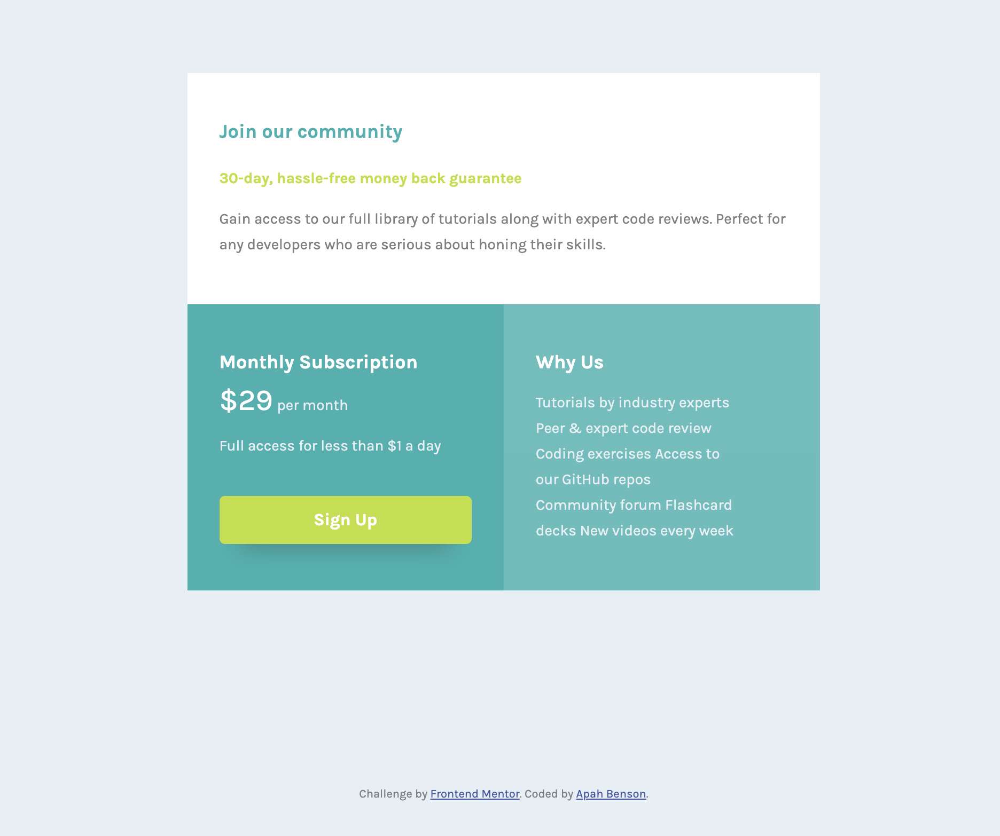

# Frontend Mentor - Single price grid component solution

This is a solution to the [Single price grid component challenge on Frontend Mentor](https://www.frontendmentor.io/challenges/single-price-grid-component-5ce41129d0ff452fec5abbbc). Frontend Mentor challenges help you improve your coding skills by building realistic projects.

## Table of contents

- [Overview](#overview)
  - [The challenge](#the-challenge)
  - [Screenshot](#screenshot)
  - [Links](#links)
- [My process](#my-process)
  - [Built with](#built-with)
  - [What I learned](#what-i-learned)
  - [Continued development](#continued-development)
- [Author](#author)

## Overview

### The challenge

Users should be able to:

- View the optimal layout for the component depending on their device's screen size
- See a hover state on desktop for the Sign Up call-to-action

### Screenshot



### Links

- Solution URL: [Add solution URL here](https://github.com/apah-dev/single-price-grid-component-master.git)
- Live Site URL: [Add live site URL here](https://apah-dev.github.io/single-price-grid-component-master/)

## My process

### Built with

- Semantic HTML5 markup
- CSS custom properties
- Grid
- Flexbox
- Media Query

### What I learned

Learnt how to use grid to create layouts
Learnt how to span grid columns and rows to fit the layout of the design
Learnt how to use more than one media query to target different sizes of the screen

To make a blur underneath the box-shadow you have to give a spread value equal but negative to the blur value

````css
        @media (max-width: 768px) {
        .container {
          display: grid;
          grid-template-columns: 1fr;
          width: 80%;
        }
        .first {
          grid-column: 1/1;
        }
      }

      @media (max-width: 1300px) {
        .container {
          display: grid;
          grid-template-columns: 1fr;
          width: 50%;
        }
        .first {
          grid-column: 1/2;
        }
      }


     box-shadow: 0 20px 20px -20px #333;
```


## Author

- Frontend Mentor - [@apah-dev](https://www.frontendmentor.io/profile/apah-dev)
- Twitter - [@benson_apah](https://www.twitter.com/benson_apah)
````
